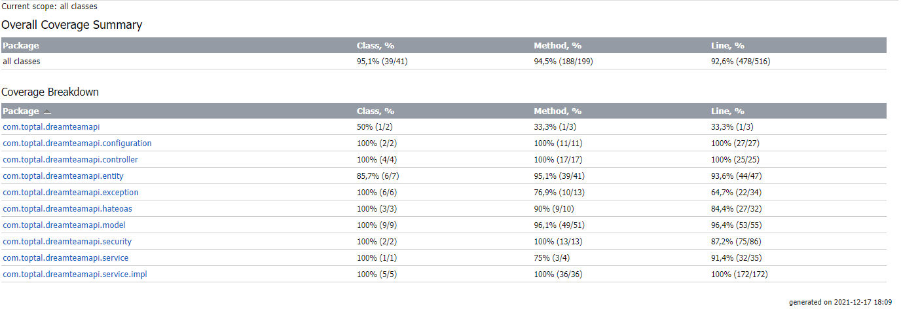

# DREAM TEAM API

### Reference Documentation

This API allows user to create their football dreamed team. The following are the functionalities offered by this API.

* Rol up new users. By creating your user, you will receive a football team composed by 20 players (3 goalkeepers, 6 defenders, 6 midfielders and 5 attackers)
* Update Team's name and country. These values are generated randomly when the team is created.
* Update Team's player's names and country. These values are generated randomly when the team is created.
* Have the possibility to sell and buy players. Your team would have a initial budget which can be used to buy new players.
* Consult the list of available player to buy and their respective price (Transfer List).
* Consult all the **teams** (User's available) and **players**. *ADMIN ONLY*

They are two roles available in this API:
1. **USER:** Allow to manage his team and buy players
2. **ADMIN:** Users rights plus querying the Team and players info from all Users.
### API endpoints

The following list depict the available endpoints of the API:

1. Authentication 
* [User Sign Up (POST)](http://localhost:8082/api/v1/auth/users)
* [User Sign In (POST)](http://localhost:8082/api/v1/auth/token)
* [User Refresh Tokens (POST)](http://localhost:8082/api/v1/auth/token/refresh)
* [User Sign Out (DELETE)](http://localhost:8082/api/v1/auth/token)

2. Team
* [Get User's Team (GET)](http://localhost:8082/api/v1/team/{{userId}})
* [Update User's Team (PATCH)](http://localhost:8082/api/v1/team)
* [Get All Teams (GET)](http://localhost:8082/api/v1/teams) *ADMIN ONLY*

3. Player
* [Get Player (GET)](http://localhost:8082/api/v1/player/{{userId}})
* [Update Player (PATCH)](http://localhost:8082/api/v1/player/)
* [Get All Players (GET)](http://localhost:8082/api/v1/player/) *ADMIN ONLY*

4. Transfer List
* [Get Transfer List (GET)](http://localhost:8082/api/v1/player/transfer-list)
* [Move Player to Transfer List  (POST)](http://localhost:8082/api/v1/player/transfer-list/{{playerId}})
* [Buy Players (DELETE)](http://localhost:8082/api/v1/player/transfer-list)

### API features

* Java/Spring boot maven project.
* In memory DB (H2)
* Oauth2 Authentication/Authorization
* Hateoas support
* Etag support
* [Swagger documentation](http://localhost:8082/v2/api-docs) and [Swagger UI](http://localhost:8082/swagger-ui.html)
* [PostMan collection](postman/Total-DreamTeam.postman_collection.json)

### How to run the API

* From the console line in the root folder of the project execute the following command to generate the .jar file.
  ```
  ./mvnw clean package
  ```
* Now run the application by:

   ```
   ./mvnw spring-boot:run
   ```
* The API by default will be reachable in the following URL *http://localhost:8082*
 


### Code Coverage
Complete coverage of the following layers:
* Controller
* Service
* Entities
* Exceptions
* Hateoas


#### Web version



### Swagger UI


1. Authentication
   
2. Team
   
3. Player
   
4. Transfer List
   